## Knifey Spooney

-Description-
Knifey Spooney is a game that is a rift on the classic game Rock Paper Scissors whick I have further evolved from a pop-culture reference. The game is a one player game, played against the computer.

The pop-culture reference stems from a scene within The Simpsons TV show. 
Follow the link to see the original scene - [The-Simpsons-Knifey-Spooney](https://www.youtube.com/results?search_query=knifey+spoony)

The game abides by the classic Rock Paper Scissors rules however with new weapons to choose from. The game has three rounds. 
At the end of the game the winning or loosing message will appear on screen. The winner message - "AHHH I see you've played knifey spooney before mate!" and the loosing message - "Thats not a knife! This is a knife!"

[Play the Game](https://sims-bit.github.io/Milestone_project_two/)

## Table of content
[UX Design](#UX-Design)
- [Strategy](#Strategy) 
- [User Stories](#User-Stories) 
- [Scope](#Scope)
- [Structure](#Structure)
- [Skeleton](#Skeleton)  
- [Surface](#Surface) 
[Technologies Used](#Technologies-Used)
[Testing](#Testing) 
- [Testing](#Testing) 
- [Bugs and Fixes](#Bugs-and-Fixes)
- [Browser Complatibility](#Browser-Complatibility )
- [Deployment](#Deployment)
[Credits and Attributes](#Credits-and-Attributes)
[Acknowledgments](#Acknowledgments)

### UX Design
#### Strategy

* The core aim of the site is to play a quick fun and simple game
* The site is designed for mobile first and perdominately as a mobile game, with media break points for larger screens.

#### User Stories
##### First time Users
- The site should be easy to understand and to navigate for the user.
- The instructions should be easily understood.
- The game should function as expected.
- 

##### Returning Users
- The game should continue to work as anticipated.
- Users should want to return to the game because it is visually apealing.

#### Scope
Function?Content?
#### Structure
* The site will consist of one page initial page with the rules to the game. 
* Javascript transitions to bring up the the users three game play options from user interaction with the welcome button.
* 

* At the end of the game there will the final game message to indicate the winner and loser.

#### Design
#### Skeleton
Wireframes -- As the game is designed as a meme figit game 

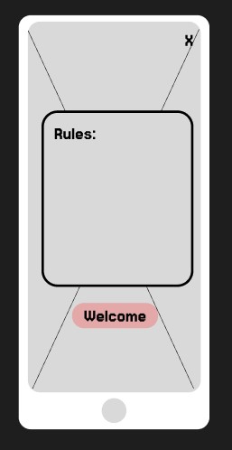
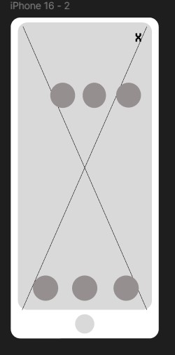
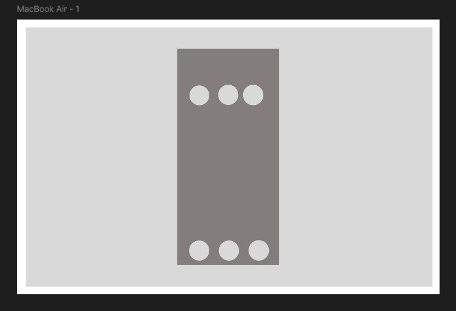

#### Surface 

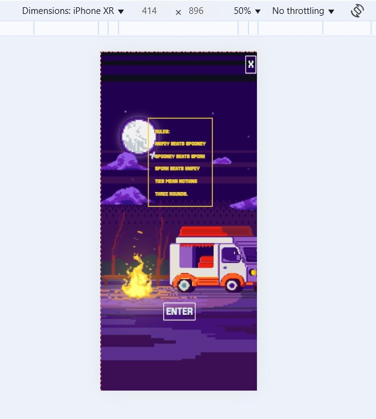
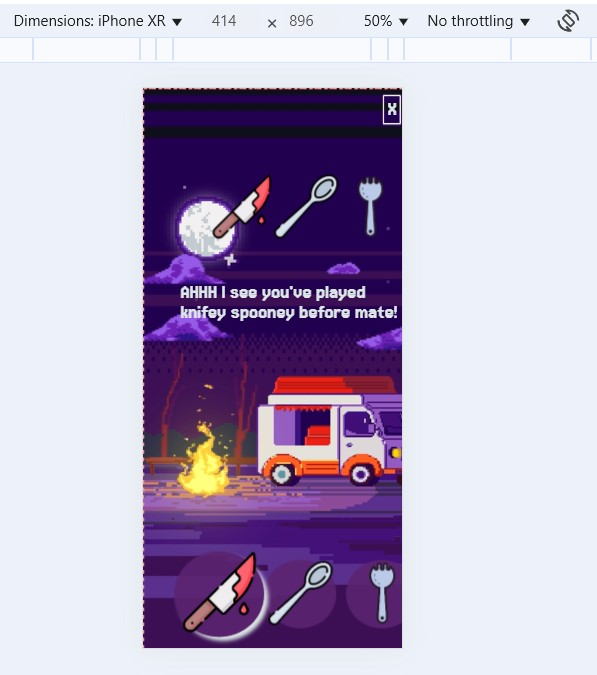
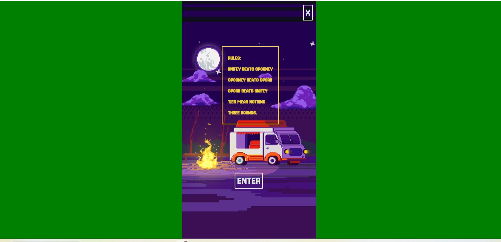
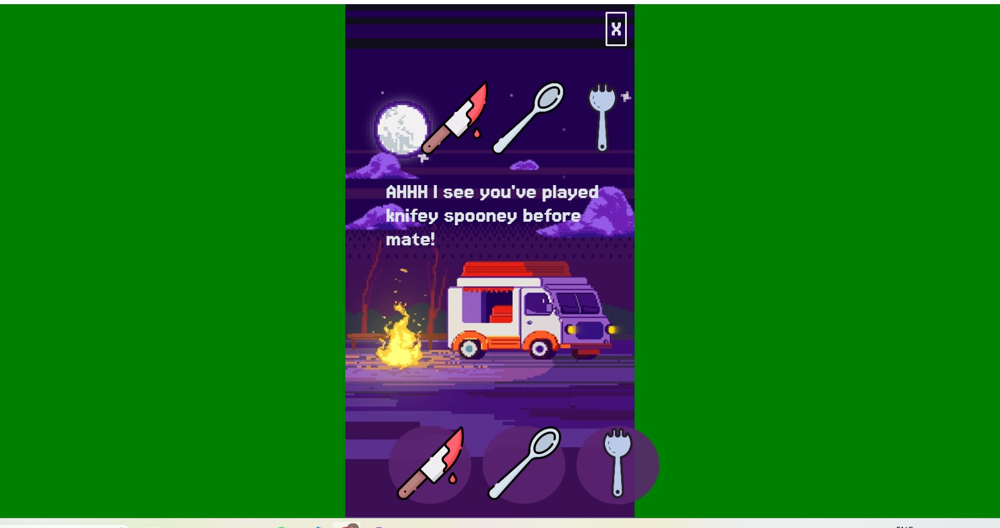
Screenshots of the game pages

## Technologies Used
- Visual Studio Code
- HTML
- CSS
- JavaScript
- Git 
- Github
- Googlefonts 
- Dev Tools
- [Tinypng](https://tinypng.com) 
- [Freepik](https://www.freepik.com) -- background “Designed by Freepik”
- [W3schools](https://www.w3schools.com) 
- [cssanimation](https://cssanimation.io/)
- [animate.style](https://animate.style/)
- [flaticon](https://www.flaticon.com/)
- [favicomatic](https://favicomatic.com/done) 

## Testing

| Test Description | Outcome | Status |
|---  | --- | --- |
| Welcome Page Loads Correctly | User is presented with the Welcome Page and instructions with how to play the game | Pass |
| User clicks Enter Button | Enter button and rules for the game transition off page| Pass |
| User selects one of the game options | The icon will enlarge |Passed|

| Winning or Loosing message | After the game rounds have been complete then the winning or loosing message will transition onto the screen signifying the end of the game and the result | Pass|
| Media Breakpoints | On larger screens the media breakpoints will occur at 600px resulting in the background of the screen becoming green and the maximum container width stopping at 684px | Pass |

| Game Reset | The exit button refreshes the game when the user clicks it | Pass |
| Testing site responsivity | I tested the site with Chrome Lighthouse, testing the 

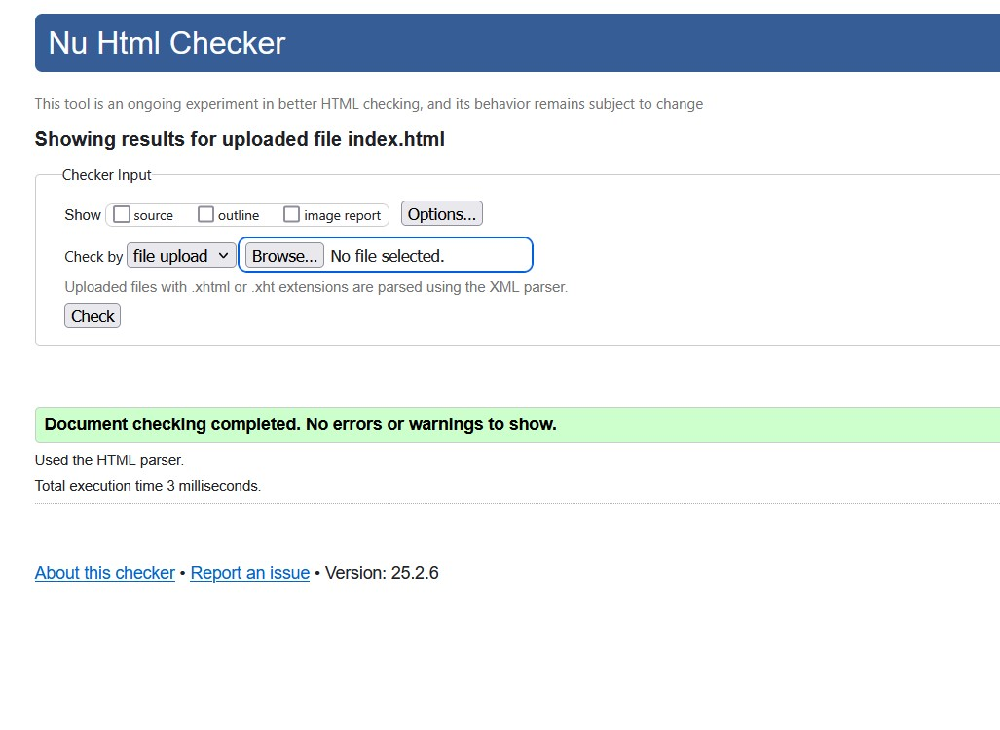
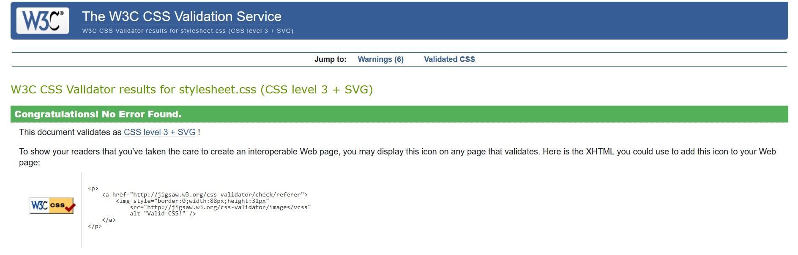
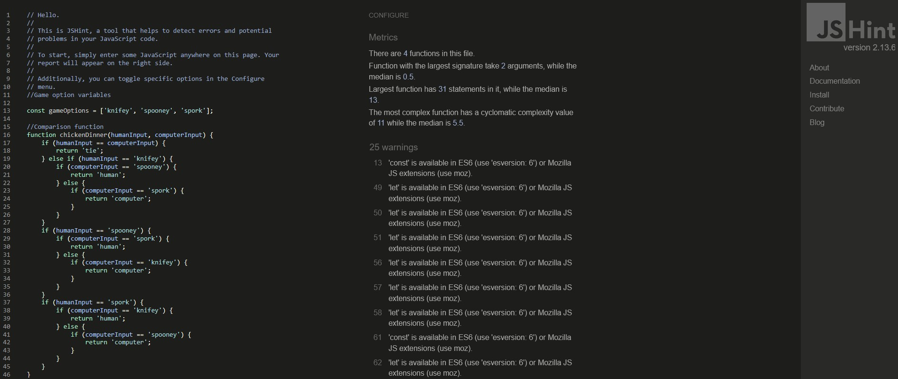
 

#### Responsivity

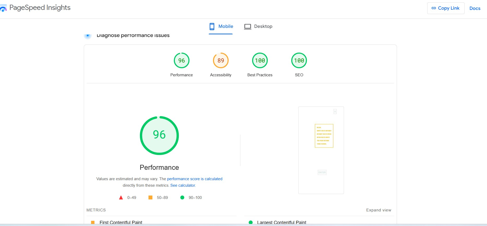
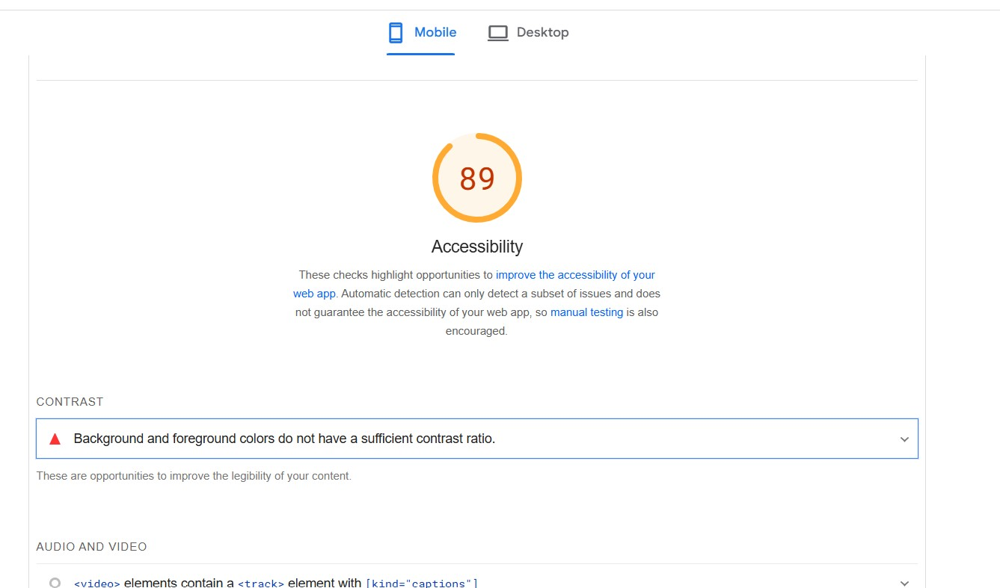
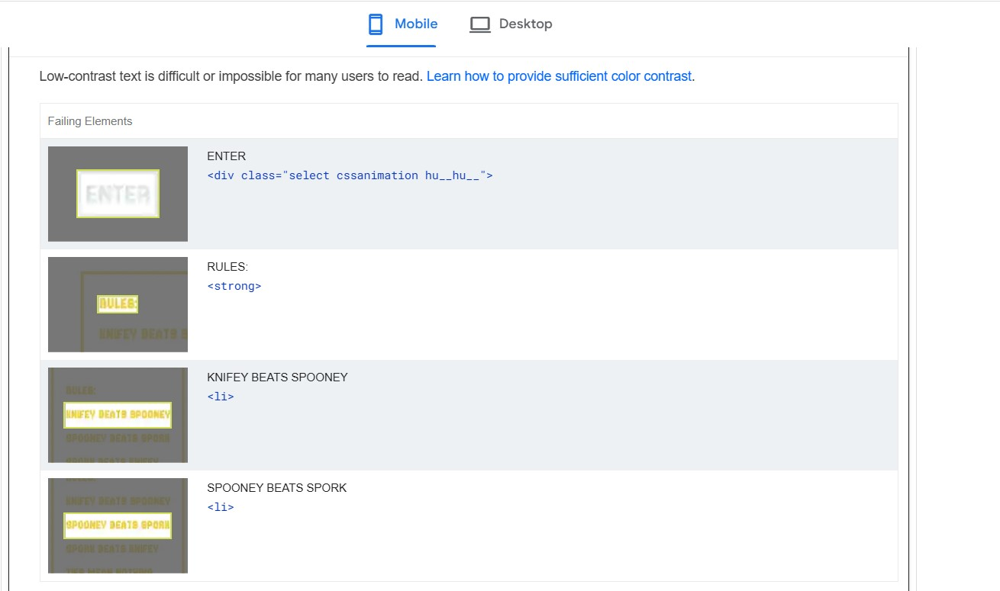
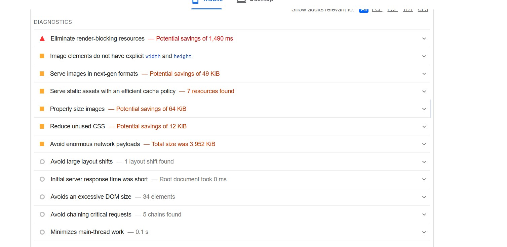
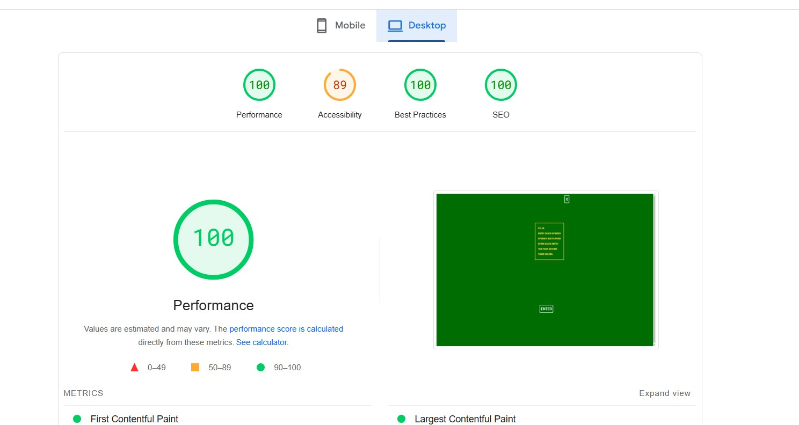

#### Bugs and Fixes

From the screenshot you can see that the initial css validation threw up two bugs. 
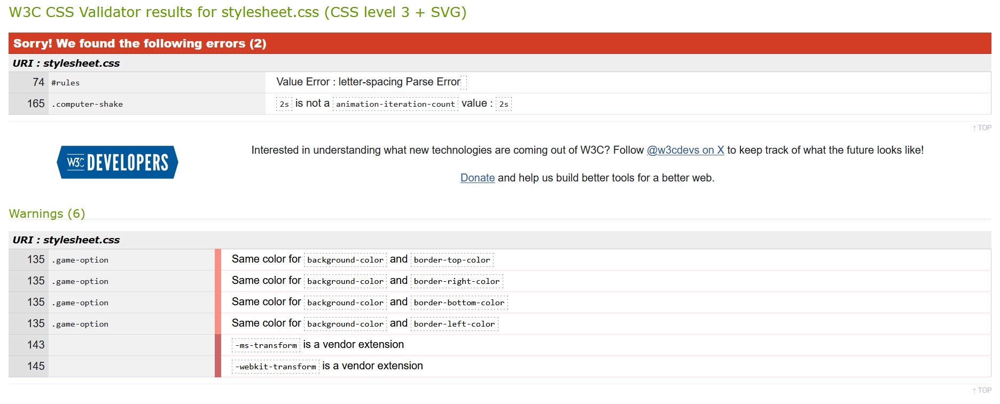

#### Browser Compatibility 
I have tested my site on the following: 
- IOS iphone
- Android phone
- Windows Desktop

#### Deployment
The site was deployed to Github Pages from its [GitHub Repository](https://github.com/sims-bit/Milestone_project_two.git), the steps are as follows:
- Log into Github
- Navigate to the to the settings tab from the Github repository.
- From the source dropdown menu select the Main branch and then save.
- The page will refresh automatically with successful deployment it will take a few moments.
- Within Github scroll back down to Github Pages and you will be able to find the link to the deployed website.

See live site [here](https://sims-bit.github.io/Milestone_project_two/). 

### Local Deployment

Cloning the project from Github:
- Within the [GitHub Repository](https://github.com/sims-bit/Milestone_project_two.git) under the repository name select "Clone or Download"
- Within the Clone with the HTTPs section, copy the repository URL.
- Open Gitbash
- Change the current directory to where you want the clone directory to be.
- Type git clone, then paste the URL you copied earlier.

- With making changes to the website, update the code as needed.
- Open a new terminal and add- git add. 
- Add- git commit -m "description of your update"
- Add- git push

[View the repository here](https://github.com/sims-bit/Milestone_project_two.git)

## Credits/ Attributes

- <a href="https://www.flaticon.com/free-icons/spork" title="spork icons">Spork icons created by agus raharjo - Flaticon</a> 
- <a href="https://www.flaticon.com/free-icons/knife" title="knife icons">Knife icons created by Freepik - Flaticon</a> 
- <a href="https://www.flaticon.com/free-icons/spoon" title="spoon icons">Spoon icons created by Freepik - Flaticon</a> 
- [Freepik](https://www.freepik.com) -- background “Designed by Freepik”
- [Googlefonts](https://fonts.google.com/selection/embed) -- for Jersey 15 and Pixelify Sans font 
- The favicon icon was generated with [favicomatic](https://favicomatic.com/done)

## Aknowledgments

