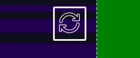

## Knifey Spooney
Knifey Spooney is a game that is a rift on the classic game Rock Paper Scissors whick I have further evolved from a pop-culture reference. The game is a one player game, played against the computer. The ideal user for the game is a person who has previous knowledge of the meme, to understand the humour and rules of play of the game.

The pop-culture reference stems from a scene within The Simpsons TV show. 
Follow the link to see the original scene - [The-Simpsons-Knifey-Spooney](https://www.youtube.com/results?search_query=knifey+spoony)

The game abides by the classic Rock Paper Scissors rules however with new weapons to choose from. The game has three rounds. 
At the end of the game the winning or loosing message will appear on screen. The winner message - "AHHH I see you've played knifey spooney before mate!" and the loosing message - "Thats not a knife! This is a knife!" Both of these messages stem from the originally game of Knifey Spooney dipicted in the original scene. 

[Play the Game](https://sims-bit.github.io/Milestone_project_two/)

## Table of content
[UX Design](#UX-Design)
- [Strategy](#Strategy) 
- [User Stories](#User-Stories) 
- [Structure](#Structure)
- [Skeleton](#Skeleton)  
- [Surface](#Surface) 
[Technologies Used](#Technologies-Used)
[Testing](#Testing) 
- [Testing](#Testing) 
- [Bugs and Fixes](#Bugs-and-Fixes)
- [Browser Complatibility](#Browser-Complatibility )
- [Deployment](#Deployment)
[Credits and Attributes](#Credits-and-Attributes)
[Acknowledgments](#Acknowledgments)

### UX Design
#### Strategy

* The core aim of the site is to play a quick fun and simple game with simple navigation and clear game rules
* Intuitive interaction design
* Responsiveness
* The site is designed for mobile first and perdominately as a mobile game, with media break points for larger screens and a #container max-width of 684px.
* The ideal visitor for the site will be a visitor that understand where the meme originates from. 

#### User Stories
##### First time Users
- The game will be familiar to those who have previous knowledge of the original meme as this is who this game is geared towards.
- The site should be easy to understand and to navigate for the user.
- The instructions should be easily understood.
- The game should function as expected.
- The game should be visually appealing.
- The game should be easily restarted at any point during the current game. 
- 

##### Returning Users
- Returning visitors should want to return because the game is fun.
- The game should continue to work as anticipated.
- Users should want to return to the game because it is visually apealing.

#### Structure
* The site will consist of one page. The initial landing page contains the rules to the game as well as a name entry requirement for the player.
* The rules simply cover the game options and which weapon beats which weapon in the game.
* If the name of the player isn't filled in, a drop down modle will be triggered informing the user that they need to enter this information before they can continue on to play the game. 
* Once the user has entered their name, they are required to click the enter button.
* This will trigger Javascript iniated css transitions to bring up the the users and computers game play options and remove the rules from user interaction with the Enter button. The users game options will be in the foreground of the screen and the game options that the computer will use will be in the background/ higher up the screen. When the user hovers over the game options avaliable to them, the game option will enlarge, informing the user that, that option is avalible for their selection.
* At the end of the game there will the final game message that will appear on the screen to indicate the winner or the loser. 
* In the top right hand corner of the screen there is a refresh button which refreshes the rounds of the game so users are able to play again.

Possible future features can inlude:
* Onscreen game score
* Highscore page
* Music to accompany the animations as well as music for when the player wins or looses.

#### Design
#### Skeleton
The wireframe views 

#### Surface 

- I chose this background because I wanted to create a game which had a cute and slightly retro feeling to it, nodding towards the more pixelated games of the 80's
- The playful pixelation theme continued with the choice of fonts, aquired from googlefonts.
- The sections and buttons in white to greatly contrast with the game background.
- The rules section created in yellow, to continue to create contrast from the background, whilst also creating contrast with the interactive elements on the landing page.
- The icons that I have chosen for the game, continue the playful and light feel of the game design. 
- I chose the camping background as I felt it play to the utensil element of the game, and the playful nature of the design. 
- At the media breakpoint I decided the body would become a high constasting green, whilst purple and green are complimentary colours, a stark difference between the background and the game.

- Initially the design included an exit button, to restart the game, through testing it clear it would be more clear as a refresh button instead. I edited the design to incorporate this. I also went on to remove the square border from the refresh button as I felt it would create a more appealing design.

## Technologies Used
- Visual Studio Code
- HTML
- CSS
- JavaScript
- Git 
- Github
- Googlefonts 
- Dev Tools
- [Mdn](https://developer.mozilla.org/en-US/)
- [Tinypng](https://tinypng.com) 
- [Freepik](https://www.freepik.com) -- background “Designed by Freepik”
- [W3schools](https://www.w3schools.com) 
- [cssanimation](https://cssanimation.io/)
- [animate.style](https://animate.style/)
- [flaticon](https://www.flaticon.com/)
- [favicomatic](https://favicomatic.com/done) 

## Testing

| Test Description | Outcome | Status |
|---  | --- | --- |
| Welcome Page Loads Correctly | User is presented with the Welcome Page and instructions with how to play the game | Pass |
| User clicks Enter Button | Enter button and rules for the game transition off page| Pass |
| User selects one of the game options | The icon will enlarge and create a shadow effect |Passed|
| Winning or Loosing message | After the game rounds have been complete then the winning or loosing message will transition onto the screen signifying the end of the game and the result | Pass|
| Media Breakpoints | On larger screens the media breakpoints will occur at 600px resulting in the background of the screen becoming green and the maximum container width stopping at 684px | Pass |
| Computer option Shake | Testing the computer will shake once the option has been determined | Passed |
| Game Reset | The exit button refreshes the game when the user clicks it | Pass |
| Testing site responsivity | I tested the site responsivness with Chrome Lighthouse| Passes|

 

#### Responsivity

#### Bugs and Fixes

From the screenshot you can see that the initial css validation threw up two bugs. 

#### Browser Compatibility 
I have tested my site on the following: 
- IOS iphone
- Android phone
- Windows Desktop- Chrome and Firefox

#### Deployment
The site was deployed to Github Pages from its [GitHub Repository](https://github.com/sims-bit/Milestone_project_two.git), the steps are as follows:
- Log into Github
- Navigate to the to the settings tab from the Github repository.
- From the source dropdown menu select the Main branch and then save.
- The page will refresh automatically with successful deployment it will take a few moments.
- Within Github scroll back down to Github Pages and you will be able to find the link to the deployed website.

See live site [here](https://sims-bit.github.io/Milestone_project_two/). 

### Local Deployment

Cloning the project from Github:
- Within the [GitHub Repository](https://github.com/sims-bit/Milestone_project_two.git) under the repository name select "Clone or Download"
- Within the Clone with the HTTPs section, copy the repository URL.
- Open Gitbash
- Change the current directory to where you want the clone directory to be.
- Type git clone, then paste the URL you copied earlier.

- With making changes to the website, update the code as needed.
- Open a new terminal and add- git add. 
- Add- git commit -m "description of your update"
- Add- git push

[View the repository here](https://github.com/sims-bit/Milestone_project_two.git)

## Credits/ Attributes

- <a href="https://www.flaticon.com/free-icons/spork" title="spork icons">Spork icons created by agus raharjo - Flaticon</a> 
- <a href="https://www.flaticon.com/free-icons/knife" title="knife icons">Knife icons created by Freepik - Flaticon</a> 
- <a href="https://www.flaticon.com/free-icons/spoon" title="spoon icons">Spoon icons created by Freepik - Flaticon</a> 
- <a href="https://www.flaticon.com/free-icons/refresh" title="refresh icons">Refresh icons created by srip - Flaticon</a>
- [Freepik](https://www.freepik.com) -- background “Designed by Freepik”
- [Googlefonts](https://fonts.google.com/selection/embed) -- for Jersey 15 and Pixelify Sans font 
- The favicon icon was generated with [favicomatic](https://favicomatic.com/done)
- [Textarea](https://www.w3schools.com/tags/tryit.asp?filename=tryhtml_textarea)

## Aknowledgments

Thanks to my brother for his continual help, as well as my mentor and friends.

